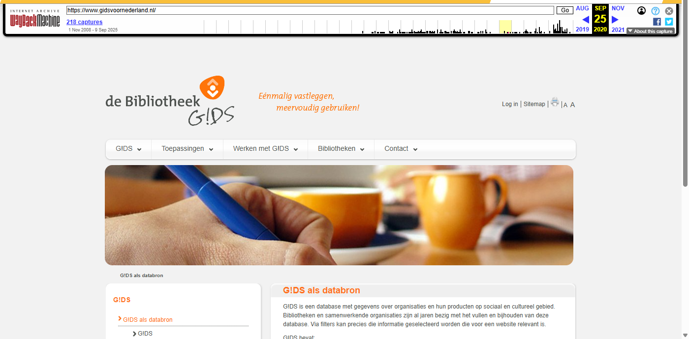
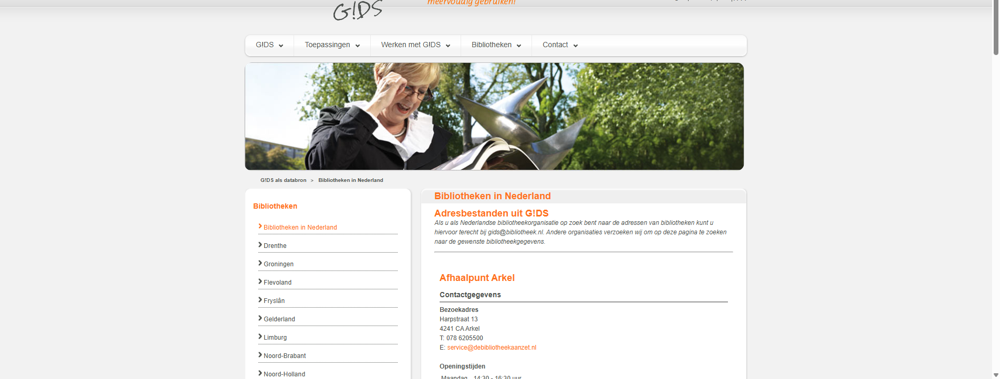
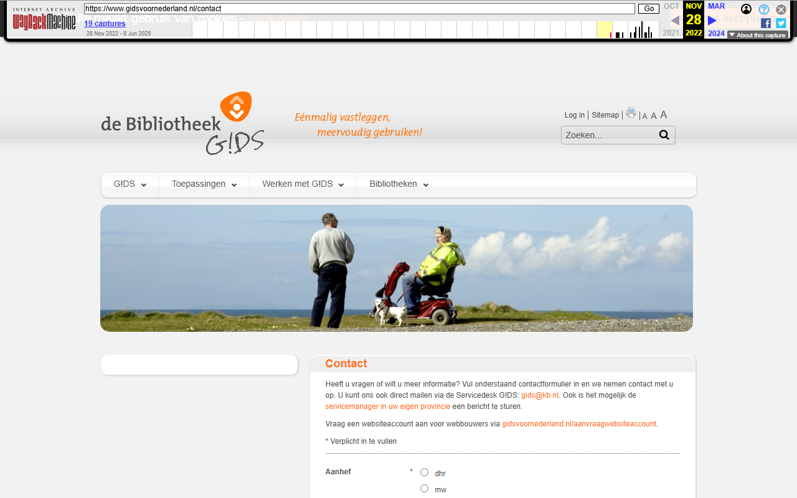
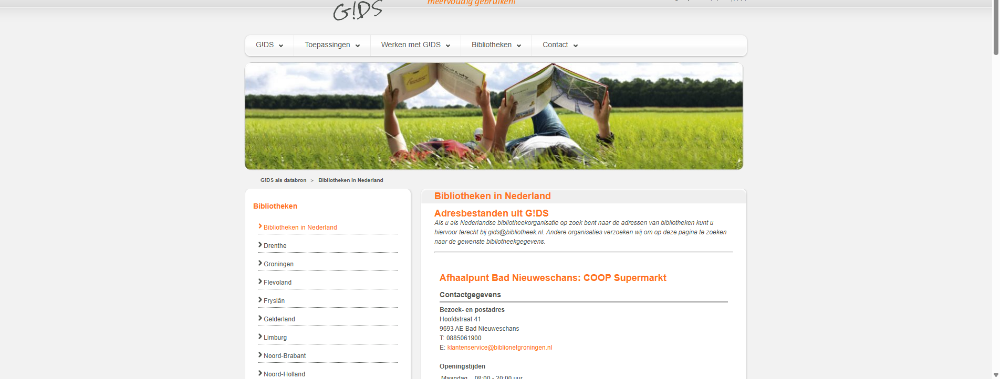
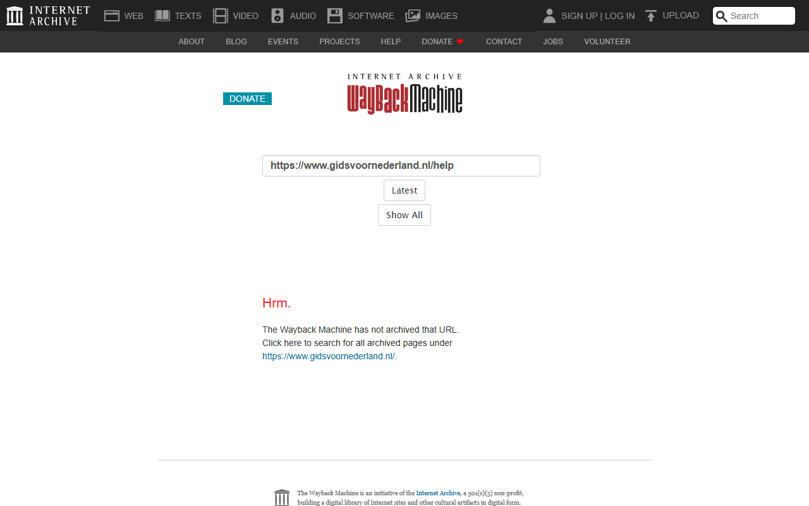

# GidsVoorNederland - Wayback Machine Archive

*Archived: November 2018*

## Wayback Machine Screenshots

| Homepage | Bibliotheken | Contact |
|:--------:|:------------:|:-------:|
|  |  |  |

| Over Ons | Help | Zoeken |
|:--------:|:----:|:------:|
|  |  |  |

## About

This folder contains URLs archived from [gidsvoornederland.nl](https://www.gidsvoornederland.nl/), specifically the section with information about public libraries in the Netherlands.

## Contents

### Main files
| File | Description |
|------|-------------|
| [Input-Gids_TeArchiverenURLs_11112018_masterfile.txt](Input-Gids_TeArchiverenURLs_11112018_masterfile.txt) | Input list of URLs to be archived |
| [Output-Gids_GearchiveerdeURLs_11112018_masterfile.txt](Output-Gids_GearchiveerdeURLs_11112018_masterfile.txt) | Output list of successfully archived URLs with Wayback Machine links |

### Subfolder: [OBwebsiteURLs](OBwebsiteURLs/)
Contains URLs related to public library (Openbare Bibliotheek) websites:
| File | Description |
|------|-------------|
| [Input-OBwebsiteURLS_master.txt](OBwebsiteURLs/Input-OBwebsiteURLS_master.txt) | Input list of public library URLs |
| [Output-OBwebsiteURLS_master.txt](OBwebsiteURLs/Output-OBwebsiteURLS_master.txt) | Output list of archived public library URLs |

## Data format

The output files contain Wayback Machine URLs in the format:
```
https://web.archive.org/web/[TIMESTAMP]/[ORIGINAL_URL]
```
