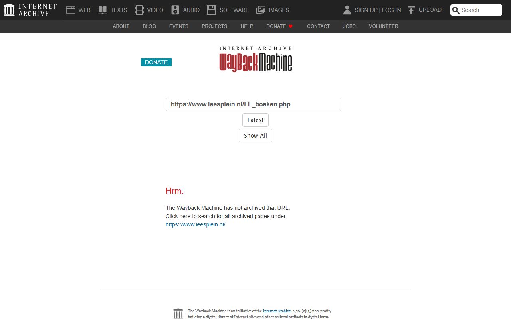
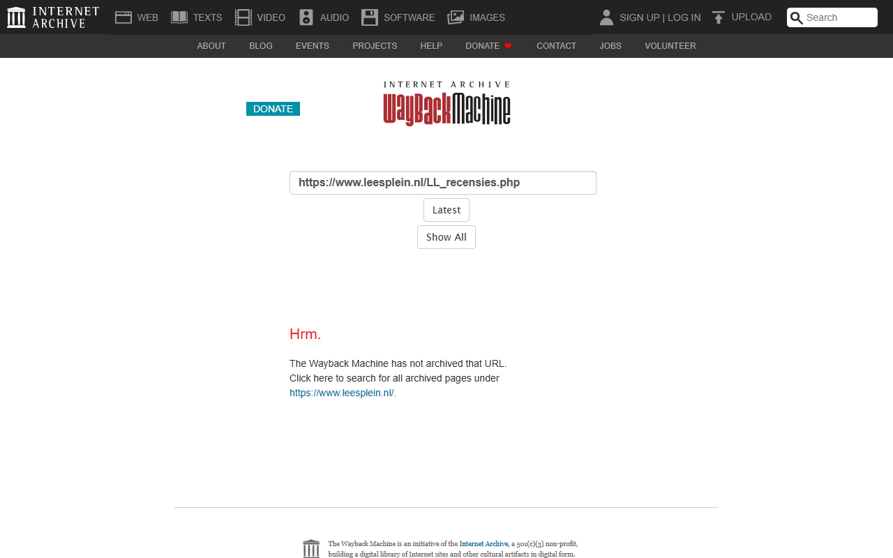
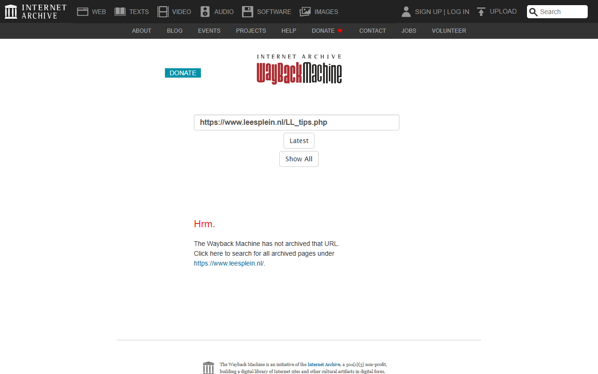

# Leesplein - Wayback Machine Archive

*Archived: June 2018*

## Wayback Machine Screenshots

| Homepage | Boeken | Schrijvers |
|:--------:|:------:|:----------:|
|  |  |  |

| Recensies | Tips | Themas |
|:---------:|:----:|:------:|
|  |  |  |

## About

This folder contains URLs archived from [leesplein.nl](https://www.leesplein.nl/), a Dutch website focused on reading promotion and literacy for children and young adults.

## Contents

### Main files
| File | Description |
|------|-------------|
| [Input-Leesplein_TeArchiverenURLs_14062018_masterfile.txt](Input-Leesplein_TeArchiverenURLs_14062018_masterfile.txt) | Input list of URLs to be archived (~1.8 MB) |
| [Output-Leesplein_GearchiveerdeURLs_14062018_masterfile.txt](Output-Leesplein_GearchiveerdeURLs_14062018_masterfile.txt) | Output list of successfully archived URLs with Wayback Machine links (~4.7 MB) |

### Subfolder: olderstuff
Contains earlier archiving attempts and sitemap data from June 2018:
- Input/output files from 07-06-2018
- Sitemap files (XML, TXT, CSV formats)
- Various log files from the archiving process

## Data format

The output files contain Wayback Machine URLs in the format:
```
https://web.archive.org/web/[TIMESTAMP]/[ORIGINAL_URL]
```
