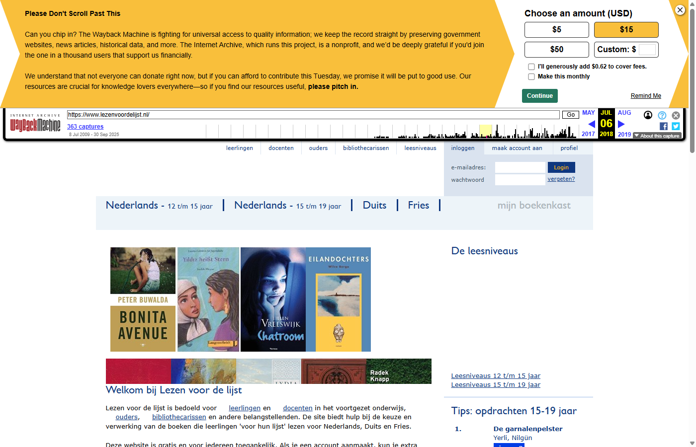
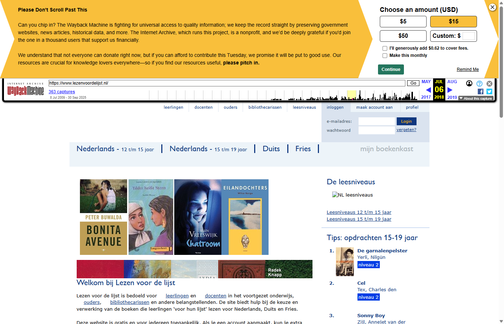
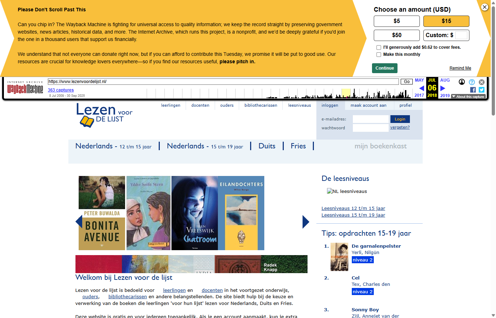
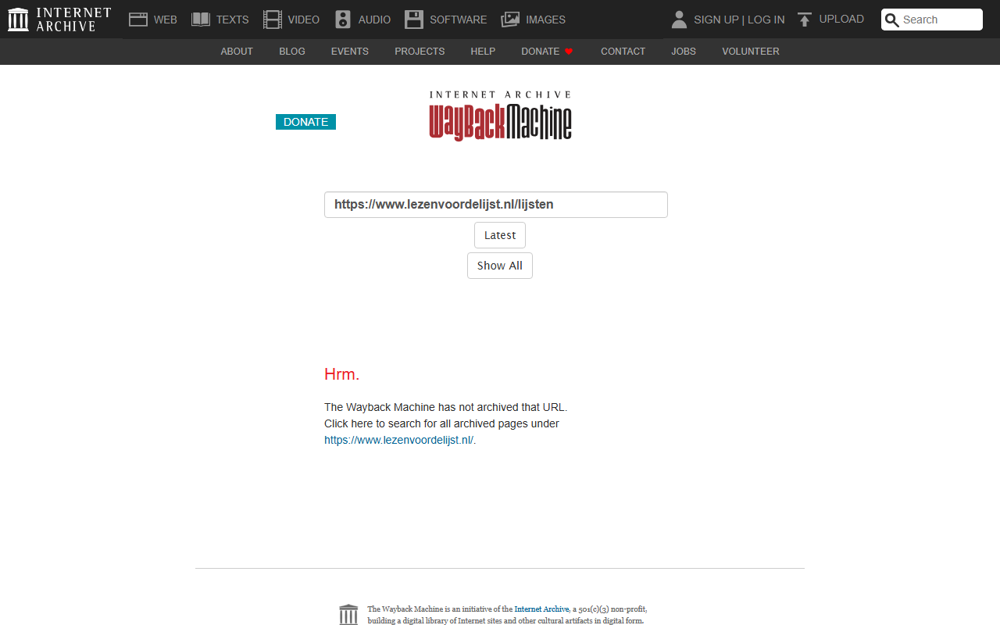
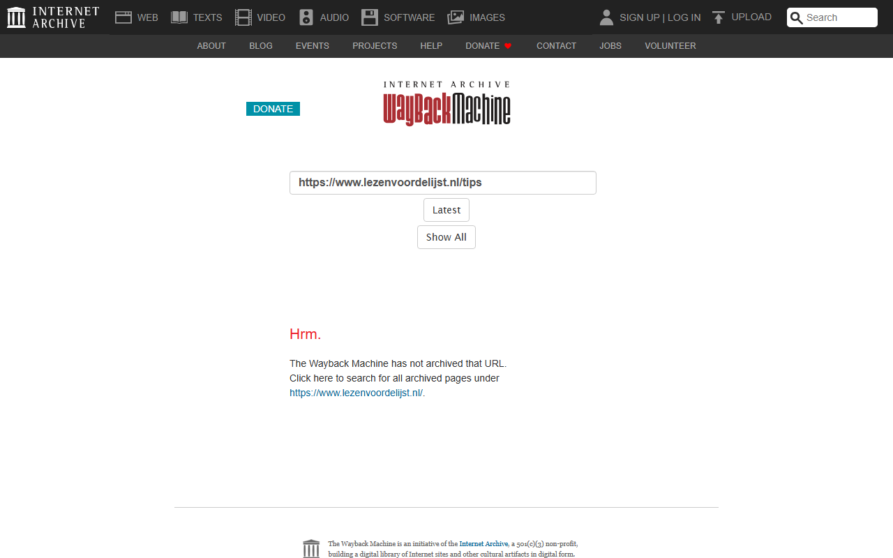

# LezenVoorDeLijst - Wayback Machine Archive

*Archived: July-August 2018*

## Wayback Machine Screenshots

| Homepage | Boeken | Schrijvers |
|:--------:|:------:|:----------:|
|  |  |  |

| Recensies | Lijsten | Tips |
|:---------:|:-------:|:----:|
|  |  |  |

## About

This folder contains URLs archived from [lezenvoordelijst.nl](https://www.lezenvoordelijst.nl/), a Dutch website that helped students find books for their required reading lists (the "leeslijst" for secondary education).

## Contents

| File | Description |
|------|-------------|
| [Input-LvdL_TeArchiverenURLs_17082018_masterfile.txt](Input-LvdL_TeArchiverenURLs_17082018_masterfile.txt) | Input list of URLs to be archived (~1.3 MB) |
| [Output-LvdL_GearchiveerdeURLs_17082018_masterfile.txt](Output-LvdL_GearchiveerdeURLs_17082018_masterfile.txt) | Output list of successfully archived URLs with Wayback Machine links (~3 MB) |

## Data format

The output files contain Wayback Machine URLs in the format:
```
https://web.archive.org/web/[TIMESTAMP]/[ORIGINAL_URL]
```
