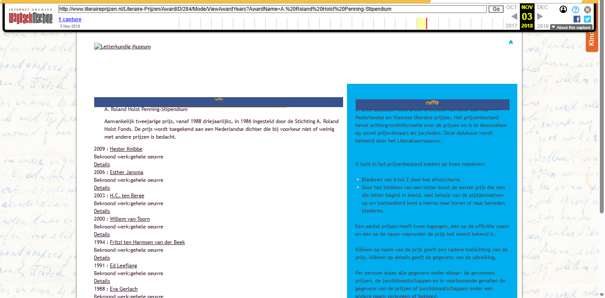
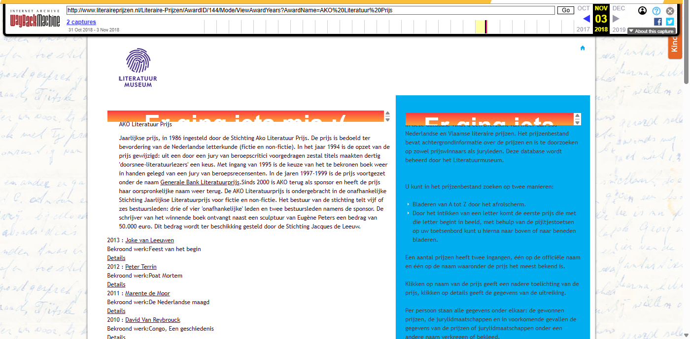
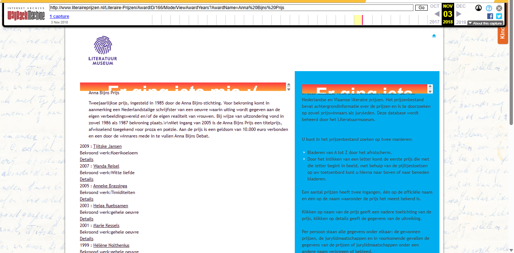
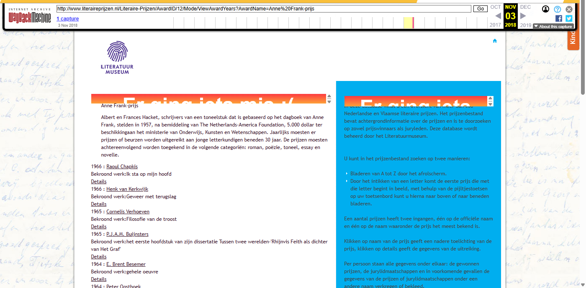
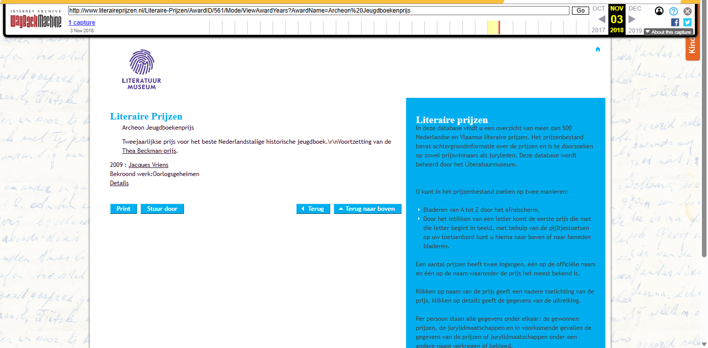

[← Back to Archived Sites](../)

# Literaireprijzen.nl - Wayback Machine Archive

*Archived: October-November 2018*

## Wayback Machine Screenshots

| Homepage | Roland Holst Prijs | AKO Literatuur Prijs |
|:--------:|:------------------:|:--------------------:|
|  |  |  |

| Anna Bijns Prijs | Anne Frank Prijs | Archeon Jeugdboekenprijs |
|:----------------:|:----------------:|:------------------------:|
|  |  |  |

## About

This folder contains URLs archived from [literaireprijzen.nl](https://www.literaireprijzen.nl/), a Dutch website providing information about literary prizes and awards in the Netherlands and Flanders.

## Contents

| File | Description |
|------|-------------|
| [Input-Lprijzen_TeArchiverenURLs_31102018_masterfile.txt](Input-Lprijzen_TeArchiverenURLs_31102018_masterfile.txt) | Input list of URLs to be archived (~55 KB) |
| [Output-Lprijzen_GearchiveerdeURLs_31102018_masterfile.txt](Output-Lprijzen_GearchiveerdeURLs_31102018_masterfile.txt) | Output list of successfully archived URLs with Wayback Machine links (~133 KB) |

## Data format

The output files contain Wayback Machine URLs in the format:
```
https://web.archive.org/web/[TIMESTAMP]/[ORIGINAL_URL]
```
