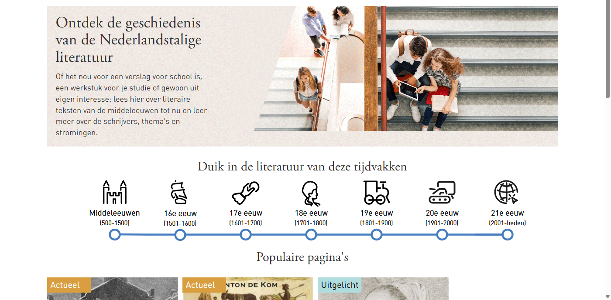
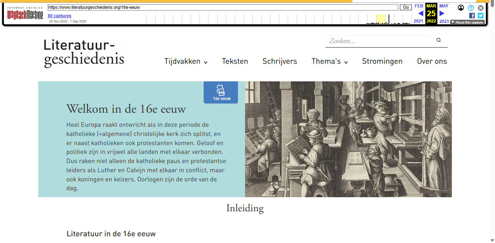
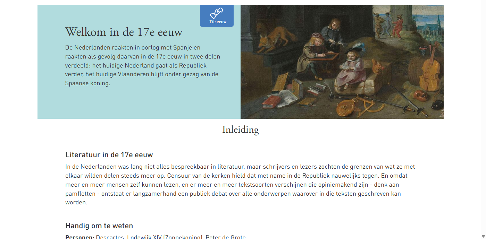
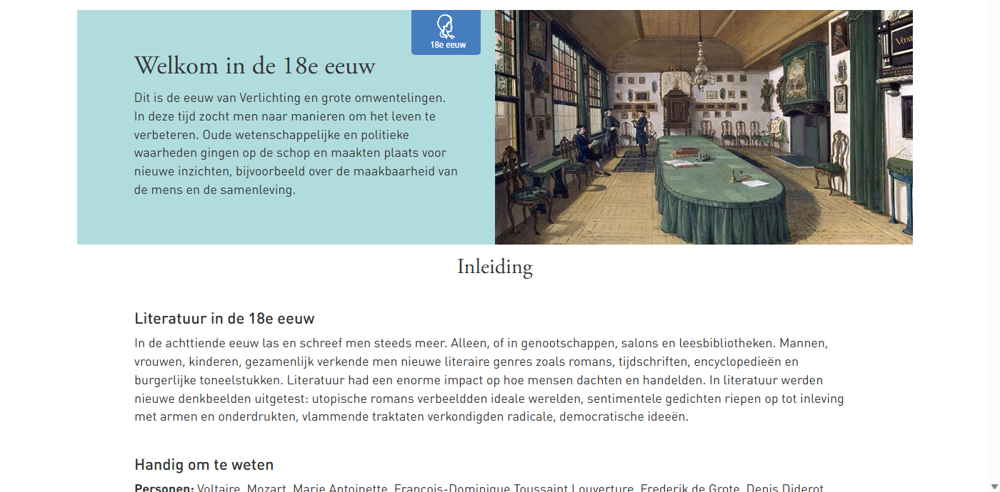
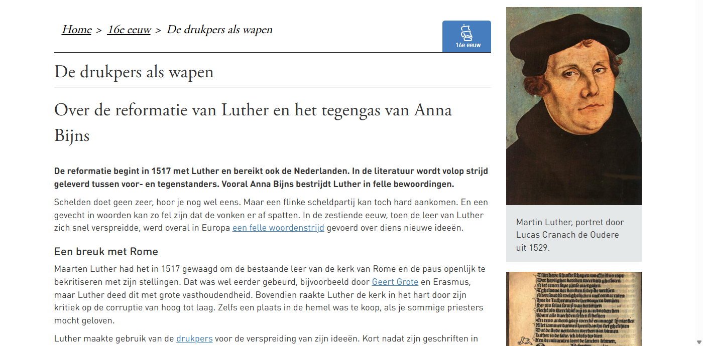
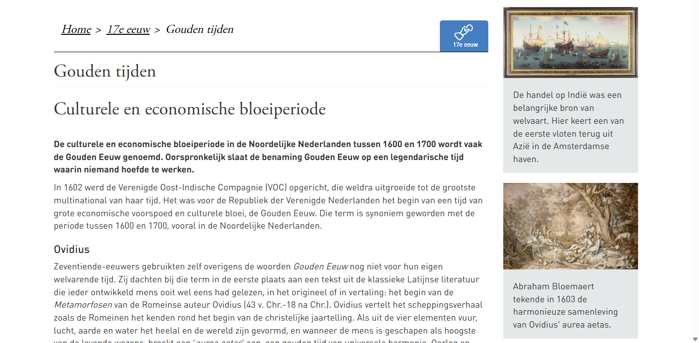

[← Back to Archived Sites](../)

# Literatuurgeschiedenis.org - Wayback Machine Archive

*Archived: March 2022*

**Note:** The folder name contains a typo ("Literaruurgeschiedenis" instead of "Literatuurgeschiedenis").

## Wayback Machine Screenshots

| Homepage | 16e Eeuw | 17e Eeuw |
|:--------:|:--------:|:--------:|
|  |  |  |

| 18e Eeuw | De Drukpers als Wapen | Gouden Tijden |
|:--------:|:---------------------:|:-------------:|
|  |  |  |

## About

This folder contains URLs archived from [literatuurgeschiedenis.org](https://www.literatuurgeschiedenis.org/), a former Dutch website about the history of Dutch literature, covering various literary periods and authors.

## Contents

### Main folder

| File | Description |
|------|-------------|
| [literatuurgeschiedenis_logo.jpg](literatuurgeschiedenis_logo.jpg) | Website logo |

### Subfolder: [25032022](25032022/)
Contains the archiving results from 25 March 2022.

| File | Description |
|------|-------------|
| [url-inputlist_25032022.txt](25032022/url-inputlist_25032022.txt) | Input list of URLs to be archived |
| [urls_literatuurgeschiedenisorg_archivedwbm_25032022.csv](25032022/urls_literatuurgeschiedenisorg_archivedwbm_25032022.csv) | Archived URLs with Wayback Machine links |
| [urls_literatuurgeschiedenisorg_archivedwbm_25032022.xlsx](25032022/urls_literatuurgeschiedenisorg_archivedwbm_25032022.xlsx) | Excel version of archived URLs |

### Screenshots (images folder)
- Homepage screenshot
- Pages about the 18th century literary period
- Page about Willem Bilderdijk
- Page about the emergence of photography

## Data format

The output CSV/XLSX files contain Wayback Machine URLs in the format:
```
https://web.archive.org/web/[TIMESTAMP]/[ORIGINAL_URL]
```
