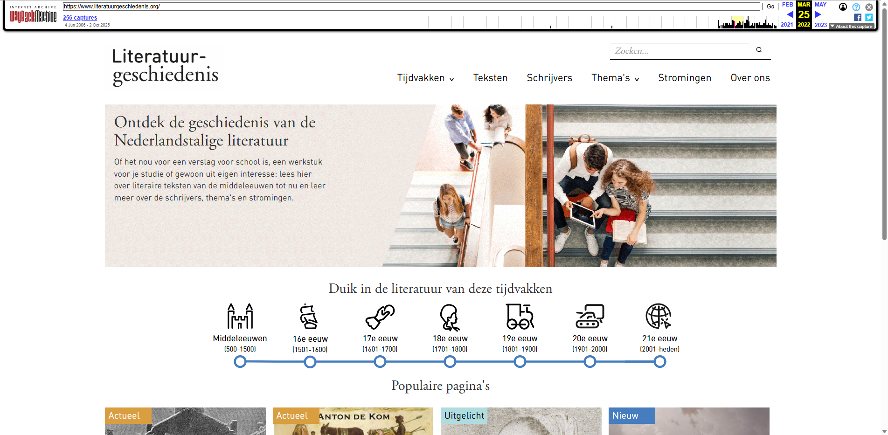
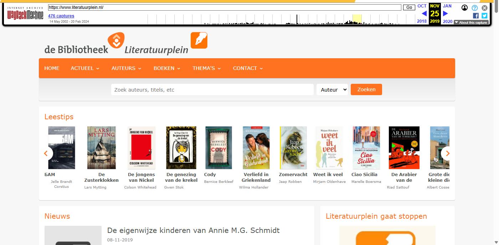

[← Back to Home](../)

# Archived sites

Browse all websites archived by KB to the Wayback Machine.

  <a href="kb.nl/" class="nav-card">
    
    <h3>kb.nl</h3>
    
KB website archives - 7,633 URLs archived

    Dec 2021 & Mar 2022
  </a>
  <a href="Literatuurgeschiedenis.org/" class="nav-card">
    
    <h3>Literatuurgeschiedenis.org</h3>
    
Literary history - 464 URLs archived

    Mar 2022
  </a>
  <a href="Literatuurplein/" class="nav-card">
    
    <h3>Literatuurplein.nl</h3>
    
Comprehensive literary portal - 69,599 URLs archived

    Dec 2019
  </a>
  <a href="GidsVoorNederland/" class="nav-card">
    
    <h3>GidsVoorNederland.nl</h3>
    
Library section - 1,415 URLs archived

    Nov 2018
  </a>
  <a href="Literaireprijzen.nl/" class="nav-card">
    
    <h3>Literaireprijzen.nl</h3>
    
Literary prizes - 452 URLs archived

    Oct 2018
  </a>
  <a href="LezenVoorDeLijst/" class="nav-card">
    
    <h3>LezenVoorDeLijst.nl</h3>
    
Reading list portal - 12,456 URLs archived

    Aug 2018
  </a>
  <a href="Leesplein/" class="nav-card">
    
    <h3>Leesplein.nl</h3>
    
Children's reading portal - 23,784 URLs archived

    Jun 2018
  </a>

