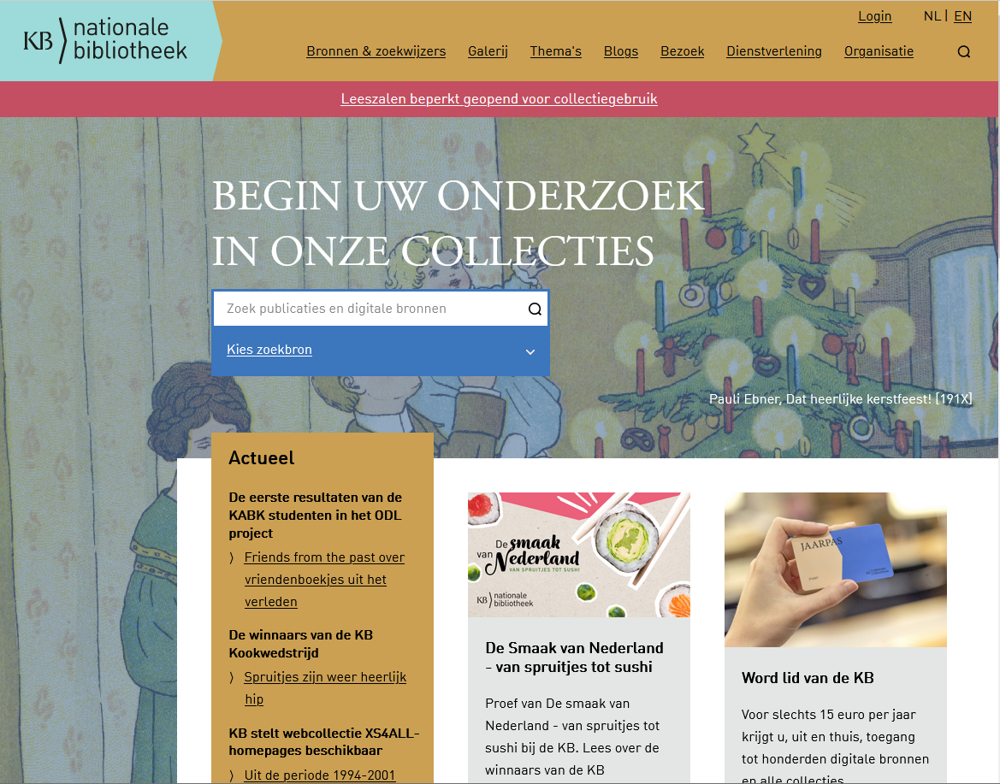
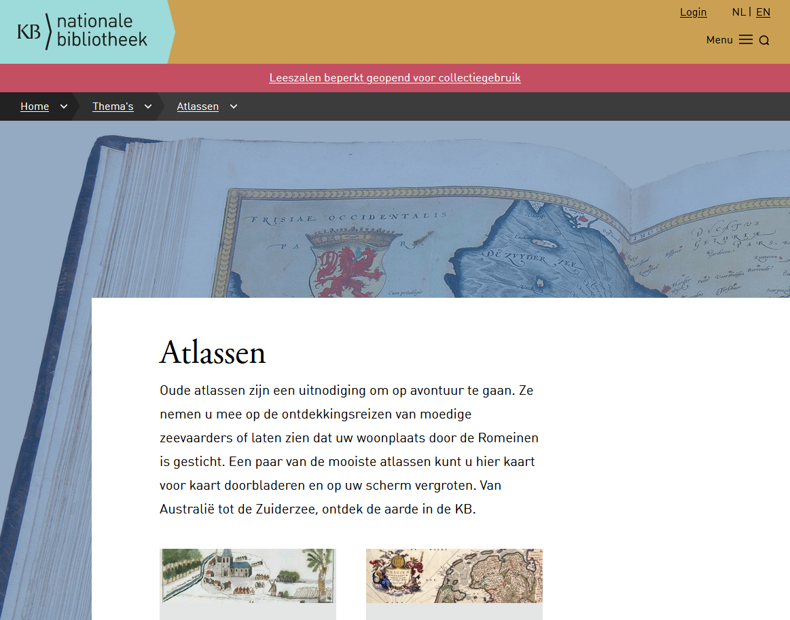
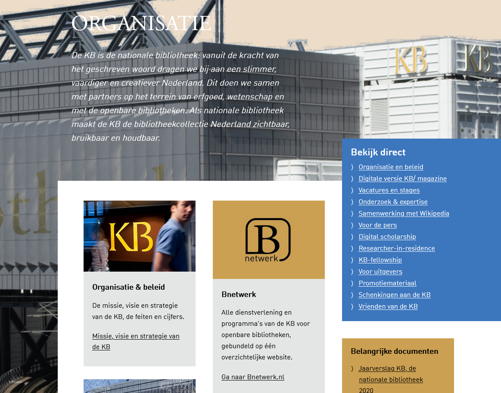

[← Back to kb.nl](../)

# kb.nl archive - December 2021 (old site)

*Archived: 24 December 2021*

## About

This folder contains URLs archived from the **old kb.nl website** before the relaunch on 17 March 2022.

## Contents

| File | Description |
|------|-------------|
| [allekbnlurls_30112021.txt](allekbnlurls_30112021.txt) | Complete list of all kb.nl URLs collected (30 Nov 2021) |
| [archived_urls_VdK_23122021.csv](archived_urls_VdK_23122021.csv) | Archived URLs contributed by Vera de Kok (23 Dec 2021) |
| [urls_kbnl_archivedwbm_24122021.csv](urls_kbnl_archivedwbm_24122021.csv) | Final list of archived URLs with Wayback Machine links |
| [urls_kbnl_archivedwbm_24122021.xlsx](urls_kbnl_archivedwbm_24122021.xlsx) | Excel version of the archived URLs |

### Screenshots

Screenshots of the old kb.nl website (28 December 2021):

| Homepage | News page |
|:--------:|:---------:|
|  |  |

| Theme page | Organisation page |
|:----------:|:-----------------:|
|  |  |

## Data format

The CSV/XLSX files contain Wayback Machine URLs in the format:
```
https://web.archive.org/web/[TIMESTAMP]/[ORIGINAL_URL]
```
