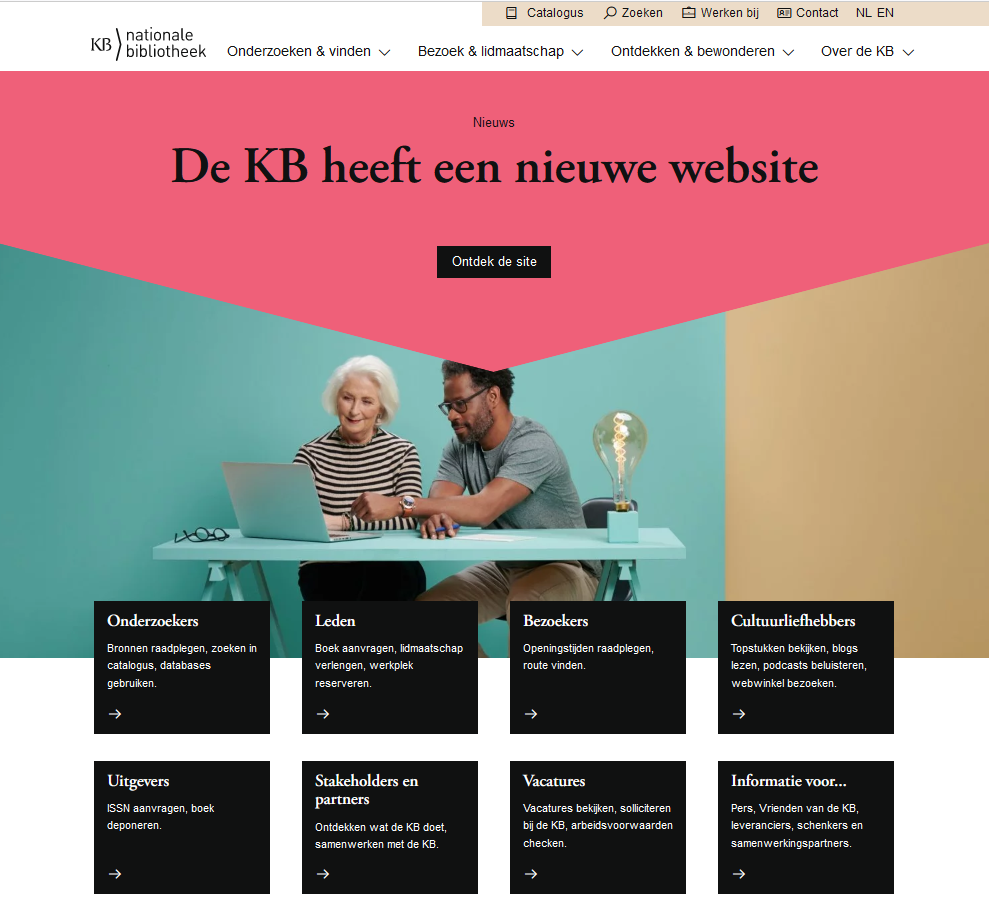
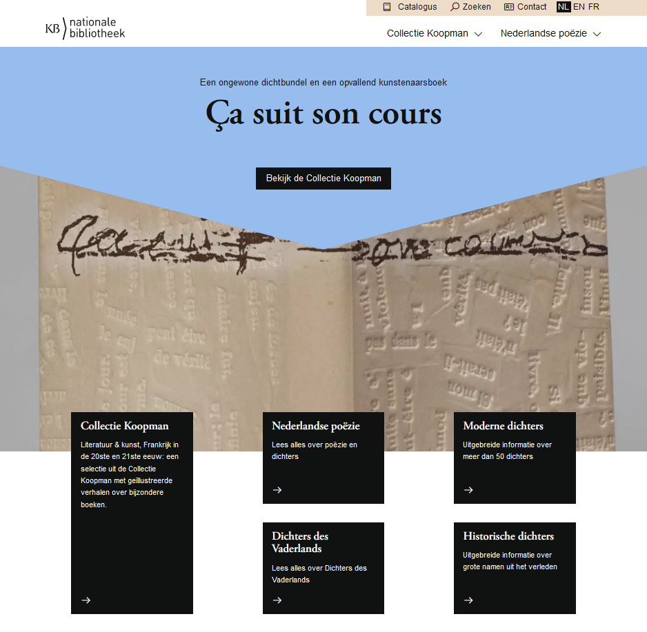

[← Back to Archived sites](../)

# kb.nl - Wayback Machine archive

*Archived: December 2021 & March 2022*

## About

This folder contains URLs archived from [kb.nl](https://www.kb.nl/), the website of the KB, national library of the Netherlands.

The KB website was relaunched on 17 March 2022. On the same day, a dedicated [KB special collections website](https://collecties.kb.nl) went live as well.

## Screenshots

### Old kb.nl (December 2021)
Screenshots from the old KB website, archived before the relaunch.

| Homepage | Theme page |
|:--------:|:----------:|
|  |  |

### New kb.nl (March 2022)
Screenshots from the new KB website, archived shortly after the relaunch.

| Homepage | Topstuk page |
|:--------:|:------------:|
|  |  |

### Collecties.kb.nl (March 2022)
Screenshots from the new KB special collections website.

| Homepage | Nederlandse Poëzie |
|:--------:|:------------------:|
|  |  |

## Contents

### [24122021](24122021/) - Old kb.nl site (December 2021)
Archived before the website relaunch.

| File | Description |
|------|-------------|
| [allekbnlurls_30112021.txt](24122021/allekbnlurls_30112021.txt) | Complete list of all kb.nl URLs |
| [archived_urls_VdK_23122021.csv](24122021/archived_urls_VdK_23122021.csv) | Archived URLs (Vera de Kok contribution) |
| [urls_kbnl_archivedwbm_24122021.csv](24122021/urls_kbnl_archivedwbm_24122021.csv) | Final archived URLs with Wayback Machine links |
| [urls_kbnl_archivedwbm_24122021.xlsx](24122021/urls_kbnl_archivedwbm_24122021.xlsx) | Excel version of archived URLs |

### [23032022](23032022/) - New kb.nl site (March 2022)
Archived shortly after the website relaunch, including the new collecties.kb.nl.

| File | Description |
|------|-------------|
| [url-inputlist_23032022.txt](23032022/url-inputlist_23032022.txt) | Input list of URLs to archive |
| [urls_kbnl_archivedwbm_23032022.csv](23032022/urls_kbnl_archivedwbm_23032022.csv) | Archived URLs with Wayback Machine links |
| [urls_kbnl_archivedwbm_23032022.xlsx](23032022/urls_kbnl_archivedwbm_23032022.xlsx) | Excel version of archived URLs |

### [sources](sources/)
Source data used to compile the URL lists:

| Subfolder | Description |
|-----------|-------------|
| [txt/](sources/txt/) | Text files with URLs from Wikipedia/Wikidata special searches |
| [xlsx/](sources/xlsx/) | Excel versions of the source data |

## Data format

The output CSV/XLSX files contain Wayback Machine URLs in the format:
```
https://web.archive.org/web/[TIMESTAMP]/[ORIGINAL_URL]
```
